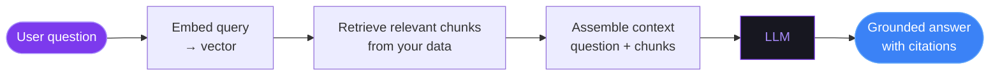
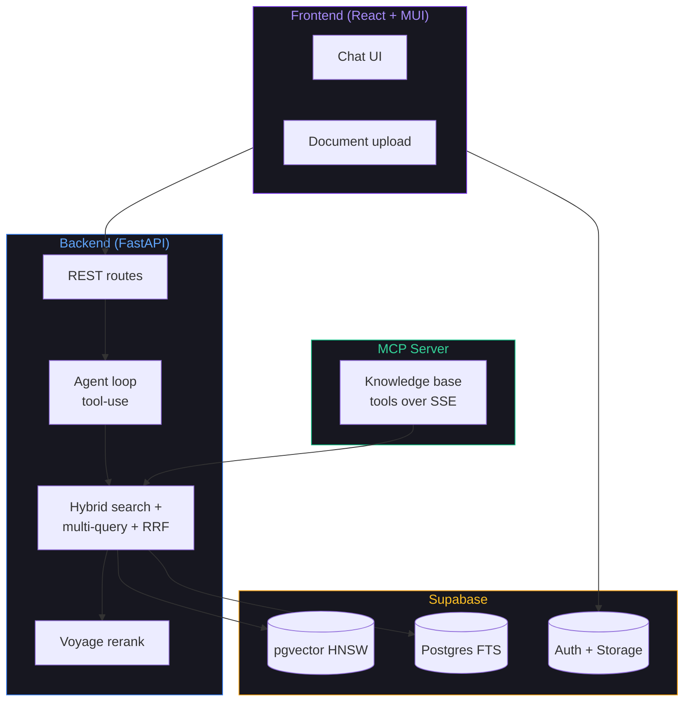
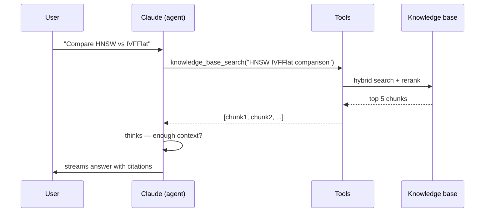
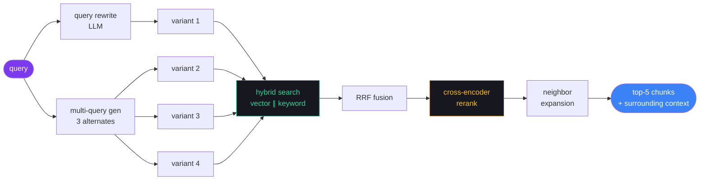

# agentic-rag

### Production RAG, running locally

A small RAG application built end-to-end:
retrieval, agent loop, evaluation, MCP, UI

<div class="text-sm opacity-60 mt-12">cosm · 2026-05-29</div>

---
layout: section
---

# Part 1 — What is RAG, and why?

---
layout: default
---

# The problem

LLMs are powerful, but:

<v-clicks>

- 🧠 **Frozen knowledge.** Training cuts off; the model doesn't know what happened last week.
- 🔒 **No access to your data.** Your docs, your tickets, your wiki — invisible to the model.
- 🎭 **Hallucination.** When the model doesn't know, it confidently makes something up.
- 📚 **No citations.** "Trust me" is not a substitute for a source.

</v-clicks>

<v-click>

<div class="mt-8 p-4 bg-purple-900/20 rounded border border-purple-500/30">
The model is a smart graduate — but you can't hand it your company's intranet.
</div>

</v-click>

---
layout: two-cols
---

# Three ways to add knowledge

::left::

### Train from scratch
- 💸 Millions of dollars
- 🕐 Months
- 🧪 Research-grade work
- For: foundation labs only

### Fine-tune
- 💸 Thousands of $, GPU-hours
- 📊 Curated dataset required
- ⚠️ Hard to update
- For: **behavior, format, tone** changes

::right::

### RAG ← *our approach*
- 💰 Cents per query
- ⚡ Update by adding a file
- 🔍 Built-in citations
- 🧩 Model-agnostic
- For: **factual knowledge** that changes

<v-click>

<div class="mt-6 p-3 bg-amber-900/20 rounded border border-amber-500/30 text-sm">
⚠️ <b>Common mistake:</b> fine-tuning to "teach the model about my docs."<br/>
RAG is almost always the better answer for that use case.
</div>

</v-click>

---
layout: default
---

# RAG in one diagram



The model's job changes: instead of recalling, it **summarizes the retrieved evidence**.

<v-click>

<div class="mt-6 text-sm opacity-80">
Three failure modes to engineer against:
<br/>1. <b>Retrieval misses</b> the right chunk → answer is wrong
<br/>2. <b>Retrieval pulls junk</b> → model gets confused
<br/>3. <b>Model ignores</b> the context → hallucinates anyway
</div>

</v-click>

---
layout: default
---

# Why RAG wins for most enterprise use cases

<div class="grid grid-cols-2 gap-6 mt-6">

<div class="p-4 bg-gray-900/30 rounded">
<h3>📚 Citations are free</h3>
Every answer links back to the source chunks. Auditable, trustworthy.
</div>

<div class="p-4 bg-gray-900/30 rounded">
<h3>🔄 Fresh data, no retraining</h3>
Add a PDF → it's searchable in seconds. No model retraining cycle.
</div>

<div class="p-4 bg-gray-900/30 rounded">
<h3>💰 Cost-effective</h3>
Per query: cents (one embedding + one LLM call). Per update: free.
</div>

<div class="p-4 bg-gray-900/30 rounded">
<h3>🔐 Data stays put</h3>
Self-hosted retrieval. Only the relevant chunk hits the LLM API.
</div>

<div class="p-4 bg-gray-900/30 rounded">
<h3>🧩 Model-agnostic</h3>
Swap GPT-4 → Claude → Llama. The retrieval layer doesn't care.
</div>

<div class="p-4 bg-gray-900/30 rounded">
<h3>📈 Easy to evaluate</h3>
Retrieval quality is measurable: <code>recall@k</code>, <code>MRR</code>, <code>nDCG</code>.
</div>

</div>

---
layout: section
---

# Part 2 — The architecture

---
layout: default
---

# agentic-rag stack



<div class="text-sm opacity-70 mt-2">
Every layer can be exercised locally — frontend, backend, MCP, and Supabase all run on your laptop.
</div>

---
layout: default
---

# The "agentic" part

Not a pipeline — an **agent loop**. Claude decides which tool to call, when.



<v-click>

Three tools available; the model picks per turn:
- `knowledge_base_search` — hybrid retrieval over user's docs
- `query_documents_metadata` — natural-language SQL over document metadata
- `web_search` — fallback for facts not in the corpus

</v-click>

---
layout: default
---

# Retrieval pipeline (the heart of it)



<div class="mt-4 grid grid-cols-2 gap-4 text-sm">
<div>
<b>Hybrid search</b> = vector similarity ∥ Postgres FTS, fused via Reciprocal Rank Fusion. Catches both semantic and lexical matches.
</div>
<div>
<b>Reranking</b> = cross-encoder (Voyage rerank-2) scores query↔chunk jointly. RRF gives a candidate set; rerank picks the best.
</div>
</div>

---
layout: section
---

# Part 3 — Demo

(switch to browser)

---
layout: default
---

# Demo plan — 4 minutes

<v-clicks>

1. **Upload a document.** Docling parses, chunker splits, embeddings stored.
2. **Ask a question.** Watch the agent loop in the terminal — `[perf]` block shows per-stage timing live.
3. **Show the answer.** Cited chunks, expandable to source.
4. **Open `[metrics]` block.** Vector vs keyword overlap, rerank kept/dropped, neighbor expansion hit rate — all visible per request.
5. **Run the eval.** `./backend/eval/run_local.sh` → 100s, prints recall@5 / MRR / nDCG@10. CI runs this on every PR.

</v-clicks>

<div class="mt-8 text-sm opacity-60">
[Screenshot placeholders here when slides ship:<br/>
1. UI chat with cited answer<br/>
2. Terminal showing [perf] + [metrics] block<br/>
3. eval report JSON<br/>
4. GitHub Actions eval workflow]
</div>

---
layout: default
---

# What you'd see in the terminal

```text {all|3-6|8-15|all}
[perf] === rag chat turn (full) ===
[perf]   round 1: anthropic call: 1850ms
[perf]   tool: knowledge_base_search: 4200ms
[perf]     phase1: rewrite + multi_query (parallel): 3083ms
[perf]     phase2: 4 variants (parallel): 437ms
[perf]     rerank: 423ms
[perf]   round 2: anthropic call: 2980ms
[perf] === rag chat turn total: 9933ms ===

[metrics] === rag chat turn (full) ===
[metrics]   query_expansion: variants=4 rewrite_changed=true
[metrics]   vector_search: per_variant=[20,18,20,19] unique=58 avg_sim=0.71
[metrics]   keyword_search: per_variant=[15,12,10,13] unique=34
[metrics]   rrf_fusion: in=92 out=58 overlap=14%
[metrics]   rerank: in=58 kept=5 dropped=53 score_p50=0.55 score_p95=0.82
[metrics]   neighbor_expansion: results=5 expanded=4 skipped_missing_hash=0
[metrics]   agent_loop: rounds=2 tool_calls=1
```

<div class="mt-4 text-sm opacity-80">
Bottleneck found on day one: <b>query rewriting + multi-query is 77% of full-mode latency.</b> The data points at where to optimize.
</div>

---
layout: section
---

# Part 4 — How we measure quality

---
layout: default
---

# The eval harness

Every PR runs an honest evaluation:

<div class="grid grid-cols-2 gap-6 mt-6">

<div class="p-4 bg-gray-900/30 rounded">
<h3 class="text-lg mb-2">Fixture corpus</h3>
20 small docs covering vector indexes, keyword search, RRF, etc.<br/>
Committed to repo. Reproducible across PRs.
</div>

<div class="p-4 bg-gray-900/30 rounded">
<h3 class="text-lg mb-2">Golden set</h3>
25 hand-labeled questions:<br/>
<code>{question, ground_truth_answer, relevant_chunk_ids, difficulty, retrieval_type}</code>
</div>

<div class="p-4 bg-gray-900/30 rounded">
<h3 class="text-lg mb-2">Deterministic IR metrics</h3>
<code>Recall@5/10/20</code>, <code>MRR</code>, <code>nDCG@10</code>.<br/>
No LLM judge. Same input → same output. Hard-gated.
</div>

<div class="p-4 bg-gray-900/30 rounded">
<h3 class="text-lg mb-2">Per-stage telemetry</h3>
Latency + counts surface bottlenecks alongside quality scores.
</div>

</div>

---
layout: default
---

# Current numbers

```text
=== IR (hard-gated, tol 0.02) ===
  recall_at_5     0.948
  recall_at_10    0.948
  recall_at_20    0.948
  mrr             0.935
  ndcg_at_10      0.9088

=== Latency p50 ===
  fast    468ms
  full   3536ms

=== By difficulty (recall@5) ===
  easy     1.000
  medium   0.950
  hard     0.840
```

<v-click>

<div class="mt-4 p-3 bg-green-900/20 rounded border border-green-500/30">
<b>Full eval runs in ~100s.</b> CI gates every PR. Retrieval regressions caught before merge.
</div>

</v-click>

---
layout: section
---

# Part 5 — Why not just use LlamaIndex / Haystack?

---
layout: two-cols
---

# Honest comparison

::left::

### LlamaIndex / Haystack
- 🧰 **Libraries** — you build the app
- 🌍 100+ integrations
- 📚 Lots of patterns to pick from
- 🎓 Steeper API surface
- 🔧 You wire up: UI, auth, deploy, eval

### Good fit when:
- You want flexibility to mix patterns
- You're integrating into existing infra
- You have engineering time to wire it all

::right::

### agentic-rag (this)
- 🚀 **Application** — opinionated, deploy-ready
- 🎯 One stack: Supabase + Voyage + Claude
- 🏗️ Built-in: UI, auth, multi-user, MCP, eval
- 📏 Honest measurement: IR gate per PR
- 🔍 Transparent: per-stage telemetry on every request

### Good fit when:
- You want a working RAG product *today*
- You value visibility into the pipeline
- Your stack matches (or you're willing to adopt it)

---
layout: default
---

# What this project does differently

<v-clicks>

- **Real-path eval.** RAGAS scores the same agent loop real users hit — not a synthetic generator. Honest measurement.
- **Per-stage observability.** `[perf]` + `[metrics]` blocks on every request. Bottlenecks are visible, not guessed.
- **CI gate.** Deterministic IR metrics (no LLM judge) hard-gated. Retrieval regressions fail the PR.
- **Local-first.** Full stack runs on your laptop: Supabase + backend + frontend + MCP. No vendor lock-in for development.
- **Agentic by design.** The model picks tools per turn. Not "retrieve, then answer" — closer to how humans use search.
- **MCP out of the box.** Expose the knowledge base to Claude Desktop, Cursor, or any MCP client with a bearer token.

</v-clicks>

---
layout: default
---

# Tradeoffs we made

<div class="grid grid-cols-2 gap-6 mt-6 text-sm">

<div class="p-3 bg-gray-900/30 rounded">
<h3>✅ Hybrid search (vector ∥ keyword)</h3>
Catches both semantic and exact matches. RRF fusion needs no normalization tuning.
</div>

<div class="p-3 bg-gray-900/30 rounded">
<h3>✅ Cross-encoder rerank</h3>
Voyage rerank-2. Adds latency (~400ms) but real quality lift.
</div>

<div class="p-3 bg-gray-900/30 rounded">
<h3>✅ Multi-query expansion</h3>
LLM generates 3 query alternates → better recall. ~3s cost, biggest perf bottleneck.
</div>

<div class="p-3 bg-gray-900/30 rounded">
<h3>✅ Parent-document neighbor expansion</h3>
Each retrieved chunk gets its prev/next siblings appended → richer context.
</div>

<div class="p-3 bg-gray-900/30 rounded">
<h3>⚠️ RAGAS as opt-in</h3>
Quality metrics that need an LLM judge are slow + noisy. Useful for diagnosis, not for CI gating.
</div>

<div class="p-3 bg-gray-900/30 rounded">
<h3>⚠️ Single vendor for retrieval</h3>
Voyage embed + rerank. Best-in-class but adds a vendor. Easy to swap later.
</div>

</div>

---
layout: default
---

# Where next

<v-clicks>

- **Cut phase-1 latency.** ~3s of LLM query rewriting per query is the obvious target. Cache for repeated phrasings? Lightweight rewriter?
- **Adversarial golden set.** Current recall@5 is 0.95 because questions phrase like the docs. Need harder questions that stress hybrid retrieval.
- **Streaming token-level.** Final answers stream block-by-block today; token-level would feel faster without changing total time.
- **Schema-as-code.** `db/schema.sql` is dumped from prod manually. A migrations system would close the loop.

</v-clicks>

---
layout: center
class: text-center
---

# Thank you

### Questions?

<div class="mt-8 text-sm opacity-60">
Repo: github.com/felipemeriga/agentic-rag<br/>
Run it locally: `./backend/run_local.sh` + `npm run dev`<br/>
Run the eval: `./backend/eval/run_local.sh`
</div>
